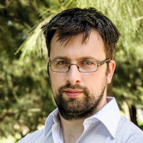

# About me

I am a postdoctoral researcher in the Mathematics and Statistics department of Murdoch University, Australia. 
I currently am interested in applying statistical methods to analyse high-throughput biological data.

I studied statistics and history & philosophy of science during undergraduate studies. 
After working as a research technician for two years, I then undertook a Bioinformatics PhD project (not yet awarded) at The Walter + Eliza Hall Institute of Medical Research and The University of Melbourne, where I investigated the ability of next-generation sequencing to detect disease-causing repeat expansions. 
This resulted in the development of an R software package [exSTRa](https://github.com/bahlolab/exSTRa/).

# Twitter

<a class="twitter-timeline" data-theme="light" data-link-color="#19CF86" href="https://twitter.com/RickTankard?ref_src=twsrc%5Etfw" data-tweet-limit="5">Latest tweets by RickTankard</a> 

# Publications

[Rick Tankard's publications on Google Scholar](https://scholar.google.com.au/citations?user=AKoK1swAAAAJ&hl=en&oi=ao) 

PhD Thesis [Identifying disease-causing short tandem repeat expansions in massively parallel sequencing data, with a focus on ataxias](https://minerva-access.unimelb.edu.au/handle/11343/197796)

# Other links

[Github](https://github.com/trickytank)

ORCID [0000-0002-8847-9401](https://orcid.org/0000-0002-8847-9401)

