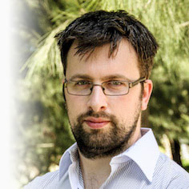

# About me

I am a Bioinformatician and Statistician based in Australia. 
I am leaving academia for now and seeking work in health and medical industries.

My LinkedIn profile is currently a work in progress https://www.linkedin.com/in/ricktankard/. 
Please message me on LinkedIn if you would like to see my CV.

I studied statistics and history & philosophy of science during undergraduate studies. 
After working as a research technician for two years, I then undertook a Bioinformatics PhD project at The Walter + Eliza Hall Institute of Medical Research and The University of Melbourne, where I investigated the ability of next-generation sequencing to detect disease-causing repeat expansions. 
This resulted in the development of an R software package [exSTRa](https://github.com/bahlolab/exSTRa/).

# Twitter

<a class="twitter-timeline" data-theme="light" data-link-color="#19CF86" href="https://twitter.com/RickTankard?ref_src=twsrc%5Etfw" data-tweet-limit="5">Latest tweets by RickTankard</a> 

# Publications

[Rick Tankard's publications on Google Scholar](https://scholar.google.com.au/citations?user=AKoK1swAAAAJ&hl=en&oi=ao) 

PhD Thesis [Identifying disease-causing short tandem repeat expansions in massively parallel sequencing data, with a focus on ataxias](https://minerva-access.unimelb.edu.au/handle/11343/197796)

# Other links

[GitHub ](https://github.com/trickytank)

<a href="https://orcid.org/0000-0002-8847-9401" target="orcid.widget" rel="noopener noreferrer" style="vertical-align:top;">orcid.org/0000-0002-8847-9401</a>

